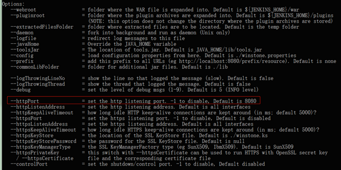

# learn flowable


## flowable 添加新功能
1 流程自由调整，可以跳转到指定任务。

参考：[Flowable节点跳转](http://www.shareniu.com/article/172.htm)

2 流程驳回，退回，任意回头步骤。 

参考： [flowable实战（五）flowable驳回/退回上一步/退回到](https://blog.csdn.net/zhongzk69/article/details/90740662)

## 子流程，调用活动


## 流程如何启动
 与流程相关的信息，要么包含在流程变量里，要么可以通过流程变量引用。
 
## 顺序流sequence flow

默认是并行的

条件顺序流conditional sequence flow


##  flowable 多人协作，
## 1. Flowable UI 使用说明


## java 命名 运行 war包



```cmd
java -jar [name].war

#可以通过命名指定 运行 war的参数，如指定端口号
java -jar [name].war --httpPort=9999
```

## 自定义事件 

## Spring/Spring boot中使用自定义事件监听
[参考](https://www.jianshu.com/p/897e0a128e54)
事件异步执行，（线程池）


## java 实现自定义事件机制 观察者模型
对象之间一对多依赖关系，主题对象变化，触发监听者事件，监听者根据具体事件执行操作。


